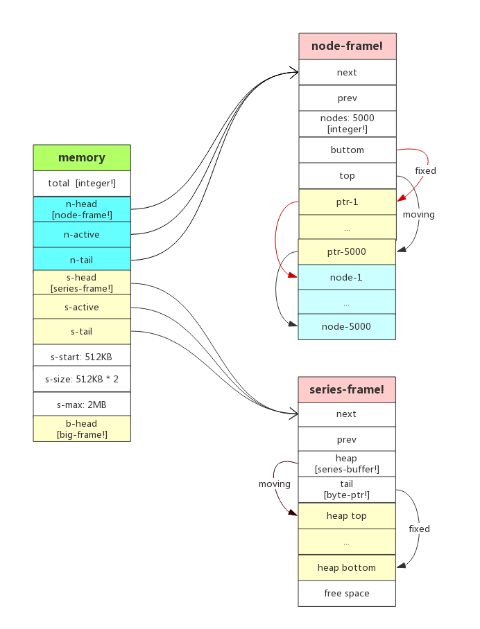
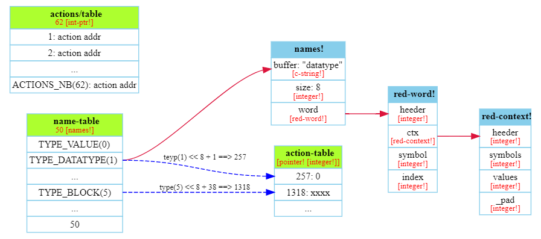
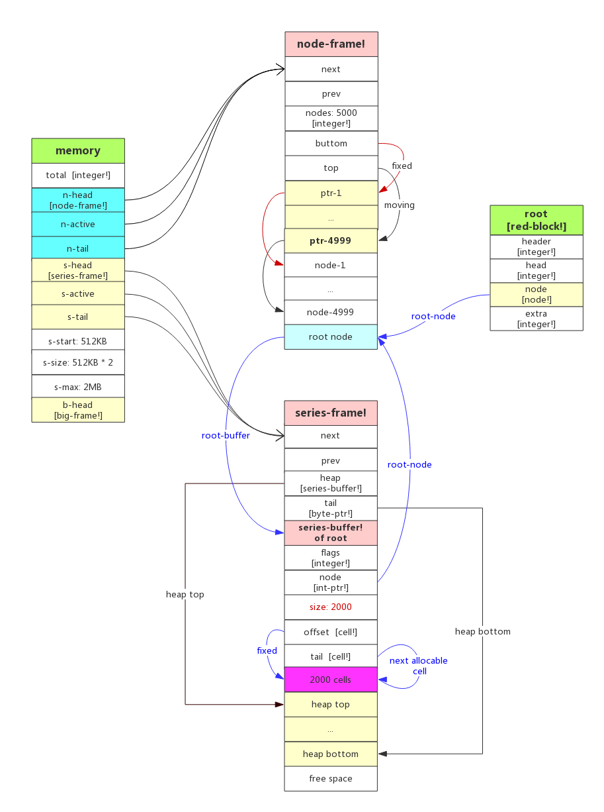
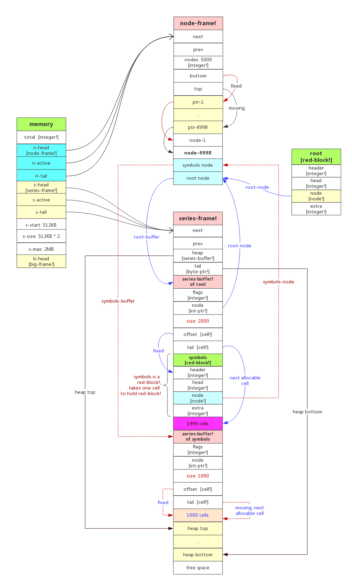
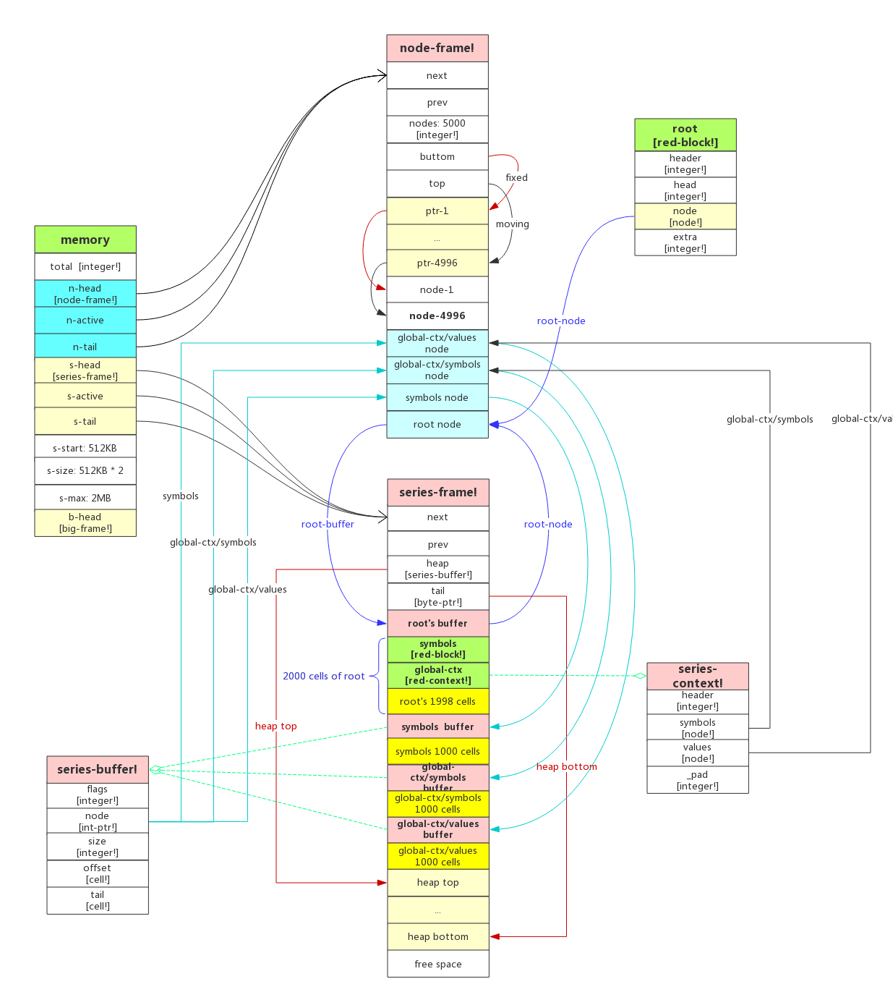
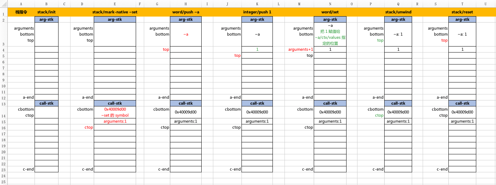
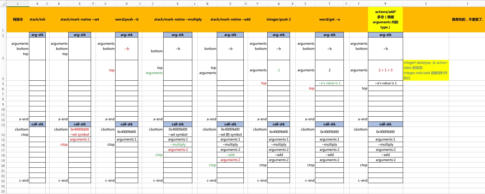

# Red runtime 初始化


## 目录

- [前提](#%E5%89%8D%E6%8F%90)
- [Red 入口](#red-%E5%85%A5%E5%8F%A3)
- [看 Red 源码的小技巧](#%E7%9C%8B-red-%E6%BA%90%E7%A0%81%E7%9A%84%E5%B0%8F%E6%8A%80%E5%B7%A7)
- [Red 运行时的初始化入口 red.reds](#red-%E8%BF%90%E8%A1%8C%E6%97%B6%E7%9A%84%E5%88%9D%E5%A7%8B%E5%8C%96%E5%85%A5%E5%8F%A3-redreds)
- [Red 内存结构及其初始化](#red-%E5%86%85%E5%AD%98%E7%BB%93%E6%9E%84%E5%8F%8A%E5%85%B6%E5%88%9D%E5%A7%8B%E5%8C%96)
    - [相关结构体的定义](#%E7%9B%B8%E5%85%B3%E7%BB%93%E6%9E%84%E4%BD%93%E7%9A%84%E5%AE%9A%E4%B9%89)
    - [`node-frame!` 初始化](#node-frame-%E5%88%9D%E5%A7%8B%E5%8C%96)
    - [`series-frame!` 初始化](#series-frame-%E5%88%9D%E5%A7%8B%E5%8C%96)
- [Red 全局变量](#red-%E5%85%A8%E5%B1%80%E5%8F%98%E9%87%8F)
    - [`name-table`](#name-table)
    - [`action-table`](#action-table)
    - [`actions/table`](#actionstable)
    - [`root`](#root)
    - [`symbols`](#symbols)
    - [`global-ctx`](#global-ctx)
    - [cell 与 node 和 buffer 的关系](#cell-%E4%B8%8E-node-%E5%92%8C-buffer-%E7%9A%84%E5%85%B3%E7%B3%BB)
    - [初始化 `global-ctx/symbols` & `global-ctx/values`](#%E5%88%9D%E5%A7%8B%E5%8C%96-global-ctxsymbols-global-ctxvalues)
    - [`natives/table`](#nativestable)
    - [`stack`](#stack)
- [Stack-VM](#stack-vm)
    - [Red 编译成基于栈的 Red/System 代码](#red-%E7%BC%96%E8%AF%91%E6%88%90%E5%9F%BA%E4%BA%8E%E6%A0%88%E7%9A%84-redsystem-%E4%BB%A3%E7%A0%81)
    - [Red 运行时栈的变化过程图](#red-%E8%BF%90%E8%A1%8C%E6%97%B6%E6%A0%88%E7%9A%84%E5%8F%98%E5%8C%96%E8%BF%87%E7%A8%8B%E5%9B%BE)
    - [actions 的「多态」调用](#actions-%E7%9A%84%E3%80%8C%E5%A4%9A%E6%80%81%E3%80%8D%E8%B0%83%E7%94%A8)
- [其他](#%E5%85%B6%E4%BB%96)


# 前提

我对 Red 的运行时很好奇，想看下是怎样用 Red/System 语言构建出 Red 的运行时。  


以下是一些需要提前知道的点：  

1. Red 的运行时是用 Red/System 语言构建出来的，即 Red 被编译成 Red/System 代码
2. Red 编译得到的 Red/System 中间代码是基于栈的（见 [官方博客](http://www.red-lang.org/2015/04/053-faster-compilation-and-extended.html)，只有一句带过）
3. Red/System 是跟 C 同等级别的语言，也有指针类型
4. Red/System 的 [语言规范](http://static.red-lang.org/red-system-specs-light.html)（中文我只 [翻译了前面 25%](https://github.com/red/red/wiki/Red-System-Language-Specification-Chinese-Traslation#47-struct)），个人认为其中 `c-string！`、`struct!` 和 `pointer!` 必看  


本文基于 **Red 0.4.0** 版本（[GitHub 源码](https://github.com/red/red/releases/tag/v0.4.0)），原因如下：
- 第一个提供 Red 可执行文件的版本，官网下载：https://static.red-lang.org/dl/win/red-040.exe
- 支持 REPL、function，在运行时这一块跟目前最新的 0.6.3 版本相比，底层并没有大改动，基本的功能已可用，内存结构变化更少
- `red.exe --help` 展示的参数中有 `--red-only`，结合 `-v <level>` 能输出 Red 代码被编译所得到的 Red/System 代码，便于理解Red 运行时被构建起来的结构与逻辑，参数见 [官方文章](http://www.red-lang.org/2013/09/040-red-goes-binary.html)
- 代码相对简单，没有引入 [Redbin](http://www.red-lang.org/2015/04/053-faster-compilation-and-extended.html) 和 [LibRedRT](http://www.red-lang.org/2017/03/062-libred-and-macros.html)，前者为了加快编译速度封装了字面量，后者似乎封装了 native 函数，总之这两者都是对 Red 运行时的优化改善，引入了中间层使得 `--red-only` 编译后的代码更复杂了  


# Red 入口

由于编译原理、生成目标机器码都过于复杂，我功力不足，先忽略它们，不影响理解 Red 运行时的构建。

因此可以用下面的参数把 `test.red` 编译生成 Red/System 代码，看 `v3.reds` 的结构结构知道 Red 运行时的入口是 `red/init` 。

```shell
cd notes/test

red-040.exe -c -v 3 --red-only test.red > v3.reds
```

跟着这一句就能找到 Red 的内存布局和一些非常关键的结构体，下一步是看 Red 运行时是怎么利用这些结构体的。  

   

另外，要是你有兴趣，我还陆续写了几篇关于相关的 wiki：  

1. [从 Red 编译成 Red System 能学到什么](https://github.com/red/red/wiki/%5Bzh-hans%5D-Compile-Red-code-to-Red-System-and-learn-something)
2. [怎样把 Red 编译成 Red/System 代码](https://github.com/red/red/wiki/%5Bzh-hans%5D-Compile-Red-to-Red-System)
3. [Red 的编译流程与 Red 运行时入口](https://github.com/red/red/wiki/%5BDOC%5D-Red-compile-process-and-build-its-runtime)
4. 官网的《[Red/System compiler overview](http://www.red-lang.org/2011/05/redsystem-compiler-overview.html)》的 [中文翻译](https://github.com/red/red/wiki/%5Bzh-hans%5D-Red-System-compiler-overview-chinese-translation)


# 看 Red 源码的小技巧

本文基于 [Red-0.4.0 版本](https://github.com/red/red/tree/v0.4.0/red/runtime)，由于 Red 和 Red/System 都还在早期阶段，没有工具支持符号跳转，因此只能用 `grep -nr '符号' .` 来搜索整个源码目录，找到一个符号的定义之处。

而符号包含两种：宏声明`#define xxx` ，函数或全局变量定义 `xxx:`，所以基本上只要用下面的方法就能找到符号的定义。

```shell
cd red-0.4.0

grep -nr 'define xxx' . #查宏定义
#或
grep -nr 'xxx:' .		#查函数、变量或 context
```

   

另外需要在主目录写一个 `test.red` 文件，包含了赋值、优先级、字符串拼接、循环、函数等必须的语法结构：

```sql
Red [ ]

;-- number
a: 1
b: 2 + a * 33
print b

;-- string
s: "hello"
prin s
print tail " world"

;-- loop
repeat a 3 [print a]

loop 2 [print "Red"]

while [a > 0] [print a i: i + 1]

;-- function
inc: func [n][n + 1]
b: inc a
print b
```

那么我们还可以在源码里加上 `print-line` 打印一些 log，每次都按以下步骤用 REBOL 编译出 `test.exe` 之后执行它，可以得到 Red 运行时构建过程中打印出我们加入的 log：

```shell
cd red-0.4.0/notes/test

./rebol
>>do/args %red.r "-c %test.red"

#执行编译完之后得到 console 可执行文件
./test.exe
```

   

   

# Red 运行时的初始化入口 [red.reds](https://github.com/red/red/tree/v0.4.0/red/runtime/red.reds)

从 [Red 的编译流程与 Red 运行时入口](https://github.com/red/red/wiki/Red-compile-process-and-build-its-runtime) 得知 `.red` 文件被编译成的 Red/System 代码结构如下：

```sql
Red/System [origin: 'Red] 

red: context [...] ;-- Red 运行时的一堆定义

red/init ;-- 初始化 Red 运行时，包括原始 datatype 的引入和定义，初始化内存结构

with red [
    exec: context [
        ------------| "Symbols" 
        ------------| "Literals"
        ------------| "Declarations"
        ------------| "Functions"
        ------------| "Main program"
    ]
]
```

那么入口在 [red/init](https://github.com/red/red/tree/v0.4.0/red/runtime/red.reds#L83) 函数，把这个函数前后的一些重要代码列在下面，日拱一卒慢慢看。

```sql
;-- 几个全局变量
_root:      declare red-block!      ;-- statically alloc root cell for bootstrapping
root:       declare red-block!      ;-- root block		
symbols:    declare red-block!      ;-- symbols table
global-ctx: declare red-context!    ;-- global context

;-- Booting... --
init: does [
    platform/init
    init-mem		;@@ needs a local context
	
    name-table: as names! allocate 50 * size? names!	 ;-- datatype names table
    action-table: as int-ptr! allocate 256 * 50 * size? pointer! ;-- actions jump table	

    datatype/init
    unset/init
    ;-- 省略几十行类似的其他 datatype 的 init 调用，其实全是调用 datatype/init 来初始化
    
    actions/init
    
    ;-- initialize memory before anything else
    alloc-node-frame nodes-per-frame        ;-- 5k nodes
    alloc-series-frame                      ;-- first frame of 512KB

    root:       block/make-in null 2000 
    symbols:    block/make-in root 1000
    global-ctx: _context/create root 1000 no

    datatype/make-words                 ;-- build datatype names as word! values
    words/build                         ;-- create symbols used internally
    refinements/build                   ;-- create refinements used internally
    natives/init                        ;-- native specific init code
    
    stack/init
]
```

   

由于 `red/init` 里的 [allocator/init-mem](https://github.com/red/red/tree/v0.4.0/red/runtime/allocator.reds#L118-L123) 函数，它除了给 `memory` 几个成员设定初始值之外，没做什么其他事，我们先看内存结构的初始化，再看几个关键的全局变量的初始化。虽然跟上面 `red/init` 源码顺序不同，但完全没影响。

```
init-mem: does [
	memory/total: 	0
	memory/s-start: _512KB
	memory/s-max: 	_2MB
	memory/s-size: 	memory/s-start
]
```

   

> 注1：后续的所有图片，橙色背景的是变量，浅蓝色背景的是结构体。

> 注2：有几个宏定义很常见：
>
> ```sql
> #define int-ptr!    [pointer! [integer!]] ;-- integer! 指针
> #define node!       int-ptr!              ;-- integer! 指针
> #define byte-ptr!   [pointer! [byte!]]    ;-- byte! 指针
> ```

   

   

# Red 内存结构及其初始化

以下是内存结构初始化的两行代码，涉及的结构体很多，干的事情也不少：

```sql
;-- initialize memory before anything else
alloc-node-frame nodes-per-frame        ;-- 5k nodes
alloc-series-frame                      ;-- first frame of 512KB
```

   

### 相关结构体的定义

先列出各种结构体的代码，主要是因为源代码有注释可以看看：

```sql
node-frame!: alias struct! [    ;-- node frame header
    next    [node-frame!]       ;-- next frame or null
    prev    [node-frame!]       ;-- previous frame or null
    nodes   [integer!]          ;-- number of nodes 只是保存了个数
    bottom  [int-ptr!]          ;-- bottom of stack (last entry, fixed) 固定不不动的
    top     [int-ptr!]          ;-- top of stack (first entry, moving) 会移动的
]

series-frame!: alias struct! [  ;-- series frame header
    next    [series-frame!]     ;-- next frame or null
    prev    [series-frame!]     ;-- previous frame or null
    heap    [series-buffer!]    ;-- point to allocatable region 指向可分配区域
    tail    [byte-ptr!]         ;-- point to last byte in allocatable region 指向可分配区域的末尾
]

;-- series flags --
;-- 31:     used                ;-- 1 = used, 0 = free
;-- 30:     type                ;-- always 0 for series-buffer!
;-- 29-28:  insert-opt          ;-- optimized insertions: 2 = head, 1 = tail, 0 = both 插入优化
;-- 27:     mark                ;-- mark as referenced for the GC (mark phase) GC 相关
;-- 26:     lock                ;-- lock series for active thread access only 线程锁
;-- 25:     immutable           ;-- mark as read-only 只读标记
;-- 24:     big                 ;-- indicates a big series (big-frame!)
;-- 23:     small               ;-- reserved
;-- 22:     stack               ;-- series buffer is allocated on stack 表示在栈中分配
;-- 21:     permanent           ;-- protected from GC (system-critical series) 永久保存，不被 GC 回收
;-- 20:     fixed               ;-- series cannot be relocated (system-critical series) 固定，不被重分配
;-- 19-3:   <reserved>
;-- 4-0:    unit                ;-- size in bytes of atomic element stored in buffer
                                ;-- 0: UTF-8, 1: Latin1/binary, 2: UCS-2, 4: UCS-4, 16: block! cell
series-buffer!: alias struct! [
    flags   [integer!]          ;-- series flags
    node    [int-ptr!]          ;-- point back to referring node 反向指回 node 节点
    size    [integer!]          ;-- usable buffer size (series-buffer! struct excluded) 可用的内存大小
    offset  [cell!]             ;-- series buffer offset pointer (insert at head optimization) 偏移指针
    tail    [cell!]             ;-- series buffer tail pointer  指向末尾
]

;-- cell header bits layout --
;-- 31:     lock                ;-- lock series for active thread access only 线程锁
;-- 30:     new-line            ;-- new-line (LF) marker (before the slot)
;-- 29-25:  arity               ;-- arity for routine! functions. routine! 函数标记
;-- 24-8:   <reserved>
;-- 7-0:    datatype ID         ;-- datatype number 数据类型 ID
cell!: alias struct! [
    header  [integer!]          ;-- cell's header flags
    data1   [integer!]          ;-- placeholders to make a 128-bit cell
    data2   [integer!]
    data3   [integer!]
]

big-frame!: alias struct! [     ;-- big frame header (for >= 2MB series)
    flags   [integer!]          ;-- bit 30: 1 (type = big)
    next    [big-frame!]        ;-- next frame or null
    size    [integer!]          ;-- size (up to 4GB - size? header)
    padding [integer!]          ;-- make this header same size as series-buffer! header
]
```

   

以上两行内存分配的代码完成之后，得到下图，接着就是贴代码、注释和打 log 输出来验证了，不关注细节的可以跳过。

> 注意：虚线部分是下面的代码未涉及的，但为了整体性和看清结构体的指向问题，先在图中体现出来。



   

### `node-frame!` 初始化

```sql
;-------------------------------------------
;-- Allocate a node frame buffer and initialize it
;-------------------------------------------
alloc-node-frame: func [
	size 	[integer!]      ;-- nb of nodes，node 节点的个数，传入是 5000
	return:	[node-frame!]   ;-- newly initialized frame
	/local sz frame
][
	assert positive? size
	sz: size * 2 * (size? pointer!) + (size? node-frame!)
	;-- 上面一句 sz = 5000 * 2 * 4 + (4 * 5) => 40020
	;-- size * 2 是用 5000 个 int-ptr! 指针指向 5000 个 node 节点，
	;-- 多了一个间接层，不明白为何要这样？
	;-- 似乎图中右边第二个 node-frame! 的图那种结构也能满足？？
	;-- 一个 node-frame! 有 5 个成员，32位下每个都是 4 byte!

	frame: as node-frame! allocate-virtual sz no ;-- R/W only 分配虚拟内存，系统相关，忽略不看

	frame/prev:  null
	frame/next:  null
	frame/nodes: size ;-- node 节点个数

	;--偏移掉 node-frame! 本身大小之后就是第一个 int-ptr! 指针的地址了
	frame/bottom: as int-ptr! (as byte-ptr! frame) + size? node-frame!

	;--再偏移 size 个 int-ptr! 就是第一个 node 节点的地址了，-1 则是最后一个 node 的地址
	frame/top: frame/bottom + size - 1	;-- point to the top element
	
	;-------------------------------------------加上几句 log 来验证
	print-line [lf "...alloc-node-frame..."]
	print-line ["size:nodes: " size ", sz: " sz ", size? node-frame!: " size? node-frame!]
	print-line ["frame/bottom: " frame/bottom "->" frame/bottom/value]
	print-line ["frame/top: " frame/top "->" frame/top/value]
	print-line ["frame: " frame ", byte-ptr!: " as byte-ptr! frame]
	;-------------------------------------------

	either null? memory/n-head [
		;--首次初始化，n-head 肯定为空，设置 memory 的成员
		memory/n-head: frame			;-- first item in the list
		memory/n-tail: frame
		memory/n-active: frame
	][
		;--不是第一次，追加链接到新的 node-frame! 结构体的 next 指针
		memory/n-tail/next: frame		;-- append new item at tail of the list
		frame/prev: memory/n-tail		;-- link back to previous tail
		memory/n-tail: frame			;-- now tail is the new item
	]
	
	;--下面这个函数是给 5000 个 int-ptr! 指针指向 5000 个 node 节点
	format-node-stack frame				;-- prepare the node frame for use
	frame
]
```

初始化 `node-frame!` 中的栈空间，**注意这个栈空间是按 bottom->top 的下标递增的**：

```sql
;-------------------------------------------
;-- Format the node frame stack by filling it with pointers to all nodes
;-------------------------------------------
format-node-stack: func [
	frame [node-frame!]          ;-- node frame to format
	/local node ptr
][
	ptr: frame/bottom            ;-- point to bottom of stack 栈底指针
	node: ptr + frame/nodes      ;-- first free node address 栈底偏移 N 个地址，指向第一个 node

	;-------------------------------------------
	print-line [lf "...format-node-stack..."]
	print-line ["ptr: " ptr "->" ptr/value ", node: " node]
	n: 0
	;-------------------------------------------

	until [
		;--下一句即图中的 prt-N 指向 node-N 节点
		ptr/value: as-integer node	;-- store free node address on stack

		;-------------------------------------------
		n: n + 1
		if n <= 5 [print-line ["n: " n ", ptr: " ptr "->" as int-ptr! ptr/value ", node: " node]]
		if n > 4995 [print-line ["n: " n ", ptr: " ptr "->" as int-ptr! ptr/value ", node: " node]]
		;-------------------------------------------

		node: node + 1		;--即图中的 node-1 ~ 5000 个节点逐步往下递增
		ptr: ptr + 1		;--即图中的 ptr-1 ~ 5000 个指针逐步往下递增
		ptr > frame/top		;-- until the stack is filled up
	]
]
```

如前面所说，用 REBOL 编译 `test.red` 之后执行它，因为它要先初始化 Red 运行时，所以我们上面的 `print-line` 可以打印出来（你的内存地址肯定跟下面的不一样，但数值的关系是一样的）：

```sql
...alloc-node-frame...
size:nodes: 5000, sz: 40020, size? node-frame!: 20
frame/bottom: 002D0018->0
frame/top: 002D4E34->0
frame: 002D0004, byte-ptr!: 002D0004  ;--可知 byte-ptr! 跟 int-ptr! 在 32位下是一样的

...format-node-stack...
ptr: 00290018->0, node: 00294E38  ;-- ptr/value: as-integer node
n: 1, ptr: 00290018->00294E38, node: 00294E38 ;-- 即图中 ptr-N 指向 node-N
n: 2, ptr: 0029001C->00294E3C, node: 00294E3C
n: 3, ptr: 00290020->00294E40, node: 00294E40
n: 4, ptr: 00290024->00294E44, node: 00294E44
n: 5, ptr: 00290028->00294E48, node: 00294E48
n: 4996, ptr: 00294E24->00299C44, node: 00299C44
n: 4997, ptr: 00294E28->00299C48, node: 00299C48
n: 4998, ptr: 00294E2C->00299C4C, node: 00299C4C
n: 4999, ptr: 00294E30->00299C50, node: 00299C50
n: 5000, ptr: 00294E34->00299C54, node: 00299C54
```

   

### `series-frame!` 初始化

```sql
;-------------------------------------------
;-- Allocate a series frame buffer
;-------------------------------------------
alloc-series-frame: func [
	return:	[series-frame!]				;-- newly initialized frame
	/local size frame
][
	size: memory/s-size

	print-line [lf "...alloc-series-frame..."]
	print-line ["size: " size ", memory/s-max: " memory/s-max]

	;-- 开始时 s-szie: 512KB，s-max: 2MB，所以下一句 s-size * 2，目的是？
	if size < memory/s-max [memory/s-size: size * 2]
	
	;-- 需要 memory/s-size 即 512KB 作为堆使用
	size: size + size? series-frame! 	;-- total required size for a series frame
	frame: as series-frame! allocate-virtual size no ;-- RW only
	
	either null? memory/s-head [
		;-- 首次初始化 s-head 为空
		memory/s-head: frame			;-- first item in the list
		memory/s-tail: frame
		memory/s-active: frame
		frame/prev:  null
	][
		memory/s-tail/next: frame		;-- append new item at tail of the list
		frame/prev: memory/s-tail		;-- link back to previous tail
		memory/s-tail: frame			;-- now tail is the new item
	]
	
	frame/next: null
	;-- 注意 heap 是专门用来指向 series-buffer! 结构体的，
	;-- 即所有的 series-buffer! 都是存在于 series-frame! 的堆空间的
	;-- 后面会知道 heap 第一个指向的就是 root 这个全局变量所指向的 series-buffer! 结构体
	frame/heap: as series-buffer! (as byte-ptr! frame) + size? series-frame! ;--堆的起始地址
	frame/tail: (as byte-ptr! frame) + size	;-- point to last byte in frame  ;--堆底地址

	print-line ["size: " size ", memory/s-max: " memory/s-max ", memory/s-size: " memory/s-size]
	print-line ["frame: " frame ", size? series-frame!: " size? series-frame!]
	print-line ["heap: " frame/heap " -> heap/value: " frame/heap/value]
	print-line ["tail: " frame/tail " -> tail/value: " frame/tail/value]

	frame
]
```

同样编译、运行 `test.exe` 输出如下：

```sql
...alloc-series-frame...
size: 524288, memory/s-max: 2097152
size: 524304, memory/s-max: 2097152, memory/s-size: 1048576
frame: 004E0004, size? series-frame!: 16 ;-- 16是10进制，02800004h + 1h => 02800014h，到达 heap 所在的地址
heap: 004E0014
tail: 00560014 -> tail/value:  ;-- tail 还没指向任何东西，所以为空
;-- tail - heap ==> 80000h = 524288，除以 1024 刚好是 512，即 512 KB 个地址
```

   

   

# Red 全局变量

`_root`、`root` 和 `symbols` 这 3 个都是 `red-block!` 结构体：

```sql
red-block!: alias struct! [
	header 	[integer!]		;-- cell header
	head	[integer!]		;-- block's head index (zero-based)
	node	[node!]			;-- series node pointer，后面会知道是指向 series-buffer! 的指针
	_pad	[integer!]
]
```

`global-ctx` 变量是 `red-context!` 结构体：

```sql
red-context!: alias struct! [
	header 	[integer!]		;-- cell header
	symbols	[node!]			;-- array of 32-bit symbols ID
	values	[node!]			;-- block of values (do not move this field!)
	_pad	[integer!]
]
```

   

### `name-table`

一开始 `name-table` 是一个指向 50 个 `names!` 结构体的指针，而 `names!` 中的 `/word`  成员是 `red-word!` 结构体，其 `/ctx` 成员又指向一个 `red-context!`  结构体。

从字面上猜测，每一个 name 都存在于其对应的 context 中，并保存了它在 symbol-table 和 context 中的下标。

```sql
name-table: as names! allocate 50 * size? names!	 ;-- datatype names table

names!: alias struct! [
	buffer	[c-string!]				;-- datatype name string
	size	[integer!]				;-- buffer size - 1 (not counting terminal `!`)
	word	[red-word!]				;-- datatype name as word! value
]

red-word!: alias struct! [
	header 	[integer!]				;-- cell header
	ctx		[red-context!]
	symbol	[integer!]				;-- index in symbol table
	index	[integer!]				;-- index in context
]

red-context!: alias struct! [
	header 	[integer!]				;-- cell header
	symbols	[node!]					;-- array of 32-bit symbols ID
	values	[node!]					;-- block of values (do not move this field!)
	_pad	[integer!]
]
```

因为这这一句只是初始化了 `name-table` 来承载 50 个 `names!` 结构体，还没填充初始值，它会和下面的 `action-table` 一起初始化，所以这里先不画图。

   

### `action-table`

这是 50 个 datatype 所对应的 action 的函数指针表，每个分配 256 个指针大小，后续在 Red 的 bootstrap 阶段要用 name-table 来初始化所有 datatype! 的 word：

```sql
action-table: as int-ptr! allocate 256 * 50 * size? pointer! ;-- actions jump table 

datatype/init ;--这个是最基础的，以下所有 datatype 的 init 函数都是调用 datatype/init 函数
unset/init
... ;--省略其他 datatype 的 init，都是一样的
```

看 [datatype.reds/init](https://github.com/red/red/tree/v0.4.0/red/runtime/datatypes/datatype.reds) 函数，其他的 datatype 都是非常类似的模版代码：

```sql
init: does [
	register [           ;--这里是 datatype.reds 调用自己的 register 函数
		TYPE_DATATYPE    ;--当前自身的类型，例如 TYPE_BLOCK 是继承自 TYPE_SERIES
		TYPE_VALUE       ;--父级类型
		"datatype!"      ;--当前类型的名称
		;-- General actions --
		null			;make
		null			;random
		null			;reflect
		null			;to
		:form			;--取到 action 函数的地址，假如是继承而来则用 INHERIT_ACTION 宏 -1 来代替
        ...
    ]
]
```

而 `init` 最终还是调用自身 [datatype.reds/register](https://github.com/red/red/tree/v0.4.0/red/runtime/datatypes/datatype.reds) 函数：

```sql
;-------------------------------------
;-- Load actions table with a new datatype set of function pointers
;-- 加载一个 datatype 所包含的函数指针
;-- Input: block of values with type ID in first place followed by actions pointers.
;--
;-- Returns: -
;-------------------------------------
register: func [
    [variadic]  ;--见 http://static.red-lang.org/red-system-specs-light.html#section-6.3.4
    count       [integer!]
    list        [int-ptr!] ;--指针，元素1是 datatype ID，元素2是父 datatype ID，元素3是名称
    /local
        type    [integer!]
        index   [integer!]
        parent  [integer!]
        idx     [integer!]
        name    [names!]
][
    type: list/value        ;--第一个元素是 datatype ID
    assert type < 50                    ;-- hard limit of action table

    ;--TODO 这个 top-id 每次被调用重新赋值，是要做什么？
    if type > top-id [top-id: type]     ;@@ unreliable, needs automatic type IDs
    list: list + 1
    
    parent: list/value      ;--父类型的 datatype ID
    list: list + 1
    
    name: name-table + type ;--用下标偏移，把名称、长度写入 name-table 所指向的 names! 结构体
    name/buffer: as c-string! list/value    ;-- store datatype string name
    name/size: (length? name/buffer) - 1    ;-- store string size (not counting terminal `!`)
    list: list + 1
    count: count - 3                        ;-- skip the "header" data
    
    if count <> ACTIONS_NB [
        ;--可以看每个 datatype 的 init 函数，
        ;--调用 datatype/register 时的 block 参数内元素个数都是相同的 ACTIONS_NB: 60 个
        print [
            "*** Datatype Error: invalid actions count for type: " type lf
            "*** Found: " count lf
            "*** Expected: " ACTIONS_NB lf
        ]
        halt
    ]
    
    ;--例如 1 << 8 + 1 = 256 + 1，一个 datatype 占用 256 个地址，其实现在没这么多个 action
    index: type << 8 + 1                    ;-- consume first argument (type ID), one-based index
    until [
        action-table/index: either all [
            parent <> TYPE_VALUE
            list/value = INHERIT_ACTION ;--表示该 action 从父类型继承而来
        ][
            idx: parent << 8 + 1 + (ACTIONS_NB - count) ;--得到跟父类型的该节点一样的地址
            action-table/idx                ;-- inherit action from parent
        ][
            list/value  ;--把 action 的指针地址写入 action-table
        ]
        index: index + 1
        list: list + 1
        count: count - 1
        zero? count
    ]
]
```

注意所有 datatype 的子类都在 init 函数里写死了 `ACTIONS_NB` 个 action（不支持的用 null 来留空），而 `#define ACTIONS_NB 62` ，所以上面的 action-table 其实有一点点浪费，但是代码统一易写。

上面的同时用所有 datatype 初始化了 `name-table` 和 `action-table`，继续看下一句。   


### `actions/table`

这一句的代码 [runtime/actions.reds/init](https://github.com/red/red/tree/v0.4.0/red/runtime/actions.reds) 也很相似，但**不是** `runtime/datatypes/action.reds`  文件，而是 `runtime/actions.reds`，它不是一种 datatype!，是一个叫做 `actions` 的 **context**。

```sql
actions/init ;--注意不是 action 这个 datatype
```

而且它在自己的 `actions` 这个 context 下维护了自己的 `table` 变量来保存自己的函数指针。

刚才的 `action-table` 是每个 datatype 自己的 action 函数指针。

看这个 context 内部也有函数会读取 `action-table`，那么它实现自己的 action 是为了什么？是为了多态，先忽略，后面在 stack-VM 一节会通过 add 函数的调用来解释是如何多态调用的。

   

截至目前的全局变量-结构体关系图：



   

### `root`

`root` 是 Red 运行时内存结构的跟节点：

```sql
root:	 	block/make-in null 2000		;-- 实际上数是初始化 _root 并赋值给 root
```

它是 `red-block!` 结构体：

```sql
red-block!: alias struct! [
	header 	[integer!]	;-- cell header
	head	[integer!]	;-- block's head index (zero-based)
	node	[node!]		;-- series node pointer，即 integer! 指针，后面会知道是指向 series-buffer! 的指针
	_pad	[integer!]
]
```

看 [datatypes/block.reds](https://github.com/red/red/tree/v0.4.0/red/runtime/datatypes/block.reds) 的 `make-in` 函数，**如果带了 parent，会调用 ALLOC_TAIL 宏，它是在这个 parent 所属的 series-frame! 的堆空间中申请空间创建 `series-buffer!`**。关于这一点，在下一句 `symbols: block/make-in root 1000` 传入了 `root` 可以得知，需要看整个 `ALLOC_TAIL` 宏就清楚了，代码很少。

```sql
make-in: func [
    parent  [red-block!]
    size    [integer!]                  ;-- number of cells to pre-allocate
    return: [red-block!]
    /local
        blk [red-block!]
][
    #if debug? = yes [if verbose > 0 [print-line "block/make-in"]]
    
    blk: either null? parent [
        _root ;--第一次调用时 parent 传入 null
    ][
        assert TYPE_OF(parent) = TYPE_BLOCK
        ;--第二次传入的 parent 是 _root，ALLOC_TAIL(series) 宏是 [alloc-at-tail series]
        as red-block! ALLOC_TAIL(parent)
    ]
    make-at blk size ;--首次相当于 make-at _root 2000
]
```

```sql
make-at: func [
    blk     [red-block!]
    size    [integer!]
    return: [red-block!]
][
    blk/header: TYPE_BLOCK              ;-- implicit reset of all header flags
    blk/head:   0
    blk/node:   alloc-cells size        ;-- blk 是 _root，即给 _root 指向 memory/n-active/top/value，Step 3
    blk
]
```

`alloc-cells` 是一个简单的包装，层层调用看下去，可知最终返回的是 `node-frame!` 中的一个 node，它把一个 node 叫做一个 cell：

```sql
;-------------------------------------------
;-- Wrapper on alloc-series for easy cells allocation
;-------------------------------------------
alloc-cells: func [
	size	[integer!]		;-- number of 16 bytes cells to preallocate
	return: [int-ptr!]		;-- return a new node pointer (pointing to the newly allocated series buffer)	
][
	alloc-series size 16 0	;-- optimize by default for tail insertion
]
```

把 `memory/n-active/top/value` 和 `memory/s-active/heap` 互相指向，之后把这个 node 返回给 `_root/node` ：

```sql
;-------------------------------------------
;-- Allocate a node and a series from the active series frame, return the node
;-------------------------------------------
alloc-series: func [
	size	[integer!]	;-- number of elements to store
	unit	[integer!]	;-- size of atomic elements stored
	offset	[integer!]	;-- force a given offset for series buffer
	return: [int-ptr!]	;-- return a new node pointer (pointing to the newly allocated series buffer)
	/local series node
][
	series: alloc-series-buffer size unit offset ;--得到 memory/s-active/heap
	node: alloc-node		;-- get a new node，得到 memory/n-active/top/value，这是个 node
	series/node: node		;-- link back series to node，series-buffer! 指向这个 node，Step 1
	node/value: as-integer series ;--给这个 node 指向刚申请到的 series-buffer! 结构，Step 2
	node				   ;-- return the node pointer
]
```

从 `memory/s-active` 这个 `series-buffer!` 分配空间：

```sql
;-------------------------------------------
;-- Allocate a series from the active series frame, return the series
;-------------------------------------------
alloc-series-buffer: func [
    usize   [integer!]              ;-- size in units
    unit    [integer!]              ;-- size of atomic elements stored
    offset  [integer!]              ;-- force a given offset for series buffer (in bytes)
    return: [series-buffer!]        ;-- return the new series buffer
    /local series size frame sz
][
	;--按 cell! 的大小来进行内存对齐，2000 * 16
	size: round-to usize * unit size? cell!	;-- size aligned to cell! size

    frame: memory/s-active
    sz: size + size? series-buffer!         ;-- add series header size

    series: frame/heap
    if ((as byte-ptr! series) + sz) >= frame/tail [
        ;--先忽略，sz=2000*16 小于 memory/s-size 的 512KB
        ;--因为 series-frame! 的 size=512KB
    ]   
    assert sz < _16MB                       ;-- max series size allowed in a series frame @@
    
    ;--已经从 series-frame! 分配走的空间为 sz，heap 栈顶指针要向下增长，
    ;--注意，heap 永远是 series-buffer! 结构体，所以要强转类型，前面说过
    frame/heap: as series-buffer! (as byte-ptr! frame/heap) + sz

    series/size: size ;--给新的 series-buffer! 设值，是 usize 个 cell! 的大小
    series/flags: unit
        or series-in-use                    ;-- mark series as in-use，不允许 GC 回收
        and not flag-series-big             ;-- set type bit to 0 (= series)

    either offset = default-offset [        ;--传入的 offset=0，而 default-offset=-1
        offset: size >> 1                   ;-- target middle of buffer
        series/flags: series/flags or flag-ins-both ;-- optimize for both head & tail insertions (default)
    ][
        ;--TODO 这个为了尾部插入的优化不知道目的是啥，跳过
        series/flags: series/flags or flag-ins-tail ;-- optimize for tail insertions only
    ]
    
    series/offset: as cell! (as byte-ptr! series + 1) + offset
    ;-- offset 传入 0，没改变，所以 tail 就是指向自身之后的地址，有 usize 个 cell!
    series/tail: series/offset
    series ;--即 memory/s-active/heap
]
```

从 `memory/n-active/top` 拿走一个 node 来赋值给 `_root/node`：

```sql
;-------------------------------------------
;-- Obtain a free node from a node frame
;-------------------------------------------
alloc-node: func [
	return: [int-ptr!]					;-- return a free node pointer
	/local frame node
][
	frame: memory/n-active				;-- take node from active node frame
	node: as int-ptr! frame/top/value	 ;-- pop free node address from stack
	frame/top: frame/top - 1			;-- 栈顶减少一位，Step 1
	
	if frame/top = frame/bottom [
		;-- TBD: trigger a "light" GC pass from here and update memory/n-active
		;-- GC 相关，先跳过
	]
	node
]
```


`root` 初始化之后的内存结构图（注意看蓝色带有 Step 123 的线）：



   

### `symbols`

接下来是 `symbols`，它跟下一句的 `global-ctx` 一样，都需要传入 `root`，目的是在 `root` 的 2000 个 cell 空间中，创建 `series-buffer!` 结构，所以在下面讲。

传入 `root` 效果是以 `root` 为根节点，往下遍历可以找到所有子节点，为 GC 提供了支持（感谢 qtxie 大神指导）。


```sql
symbols: 	block/make-in root 1000
global-ctx: _context/create root 1000 no
```

 `red-context!` 结构体和 `red-block!` 、 `cell!` 结构体是都是兼容的，所以代码里有强转成 `red-context!`。**其实很多结构体都是 4 个成员，可以说是全部都是互相兼容的，可以互相转型，看 [datatypes/structures.reds](https://github.com/red/red/tree/v0.4.0/red/runtime/datatypes/structures.reds) 就知道了**。

`symbols` 全局变量传入了 `root`，要先调用 `ALLOC_TAIL(parent)` 宏，即要先执行：

```sql
alloc-at-tail root
```

代码在 [common.reds](https://github.com/red/red/tree/v0.4.0/red/runtime/datatypes/common.reds)，也就是在 `root` 所指向的 `series-bubffer!` 后面的空闲区域继续分配一个新的 `series-buffer!` 给 `symbols` 来指向，同时把 `root` 指向的 `series-buffer!/tail` 继续往后偏移，方面下一次分配时又紧接着它来分配新的 `series-buffer!` 空间：

```sql
alloc-at-tail: func [
	blk		[red-block!]
	return: [cell!]
][
	alloc-tail as series! blk/node/value  ;--即 root/node 所指向的 series-buffer! 结构体
]
```

```sql
alloc-tail: func [
	s		[series!] ;-- #define series! series-buffer!
	return:  [cell!]
	/local 
		cell [red-value!]
][
	if (as byte-ptr! s/tail + 1) > ((as byte-ptr! s + 1) + s/size) [
		s: expand-series s 0
	]
	
	cell: s/tail 		;-- 紧接着 root 这个 seriese-buffer! 之后
	;-- ensure that cell is within series upper boundary
	assert (as byte-ptr! cell) < ((as byte-ptr! s + 1) + s/size)
	
	s/tail: cell + 1	;-- move tail to next cell，把 root 指向的 series-buffer! 偏移到下一个 buffer
	cell
]
```

上面的代码逻辑是：从 `root` 的 2000 个 cell 中分配到一个用来承载 `symbols`（它是 `red-block!` 结构），这个 `red-block!` 会指向一个 node，node 再指向 `series-buffer!`，而 `series-buffer!` 结构体本身用 `offset` 和 `tail` 指针来管理自己的 cell，例如 symbols 申请并分配了 1000 个 cell。

此时的内存结构如下：



###  `global-ctx`

另外一个不同之处在于 `global-ctx` 是 `red-context!` 中的 `symbols` 和 `values` 都要分配一个 `series-buffer!` 结构，其他的逻辑跟上面的 `symbols` 一样。代码见 [datatypes/context.reds](https://github.com/red/red/tree/v0.4.0/red/runtime/datatypes/context.reds)：

```sql
create: func [
    blk         [red-block!]                ;-- storage place (at tail of block)
    slots       [integer!]                  ;-- max number of words in the context
    stack?      [logic!]                    ;-- TRUE: alloc values on stack, FALSE: alloc them from heap
    return:     [red-context!]
    /local
        cell    [red-context!]
][
    #if debug? = yes [if verbose > 0 [print-line "_context/create"]]
    
    if zero? slots [slots: 1]
    
    ;-- 返回 root buf 下的一个 cell!，强转成 red-context!，两者都是 4 个成员，兼容的
    cell: as red-context! ALLOC_TAIL(blk)
    cell/header: TYPE_CONTEXT               ;-- implicit reset of all header flags  
    cell/symbols: alloc-series slots 16 0   ;-- force offset at head of buffer

    either stack? [
        cell/header: TYPE_CONTEXT or flag-series-stk
        cell/values: null                   ;-- will be set to stack frame dynamically
    ][
        cell/values: alloc-cells slots
    ]
    cell
]
```

   

最终的内存布局如下：




### cell 与 node 和 buffer 的关系

根据上面的图，可以知道这几个名词的关系图是：` 1 node <==> 1 buffer ==> 管理 N 个 cell`。

`cell!` 是含有 4 个成员的结构体，跟 [datatypes/structures.reds](https://github.com/red/red/tree/v0.4.0/red/runtime/datatypes/structures.reds) 里的绝大部分 `red-XXX!` 结构体都是兼容的，只要强制转换一下类型即可。

再重复一遍：所有 red 结构体的内存分配，都是从 `root` 的 2000 个 cell 中分配到一个用来承载 `red-XXX!` 结构体，这个 `red-XXX!` 会指向一个 node，node 再指向 `series-buffer!`，而 `series-buffer!` 结构体本身用 `offset` 和 `tail` 指针来管理自己所申请的 cell。

### 初始化 `global-ctx/symbols` & `global-ctx/values`

继续看 `red/init` 函数内的后几行，都是调用 `word/load`，所以关键是看它的实现过程和目的。

```sql
datatype/make-words     ;-- build datatype names as word! values
words/build             ;-- create symbols used internally
refinements/build       ;-- create refinements used internally
```

datatype.reds

```sql
make-words: func [
    /local
        name [names!]
        i    [integer!]
][
    i: 1
    until [
        name: name-table + i
        name/word: word/load name/buffer
        i: i + 1
        i > top-id
    ]
]
```

原本 `name-table` 的元素中已经有 `name/buffer` 保存了  `c-string`，现在要把 `name/word` 设置成 `red-word!` 类型，同时还要把这个 word 设置到全局的 context 和 symbol 中去。

先看下 `name-table` 的结构：


   

word.reds

```
load: func [
    str     [c-string!]
    return: [red-word!]
][
    _context/add-global symbol/make str
]
```

symbol.reds

```sql
make: func [
    s       [c-string!]        ;-- input c-string!
    return: [integer!]
    /local 
        sym [red-symbol!]
        id  [integer!]
][
    #if debug? = yes [if verbose > 0 [print-line "symbol/make"]]
    
    id: search s
    if positive? id [return id]
    
    ;--每次 ALLOC_TAIL(symbols) 都会使得 symbols/node/value 后的 cell 减少一个，tail + 1
    sym: as red-symbol! ALLOC_TAIL(symbols)     ;--使用 symbols 的 series-buffer! 的空间，tail 会后移一位
    sym/header: TYPE_SYMBOL                     ;-- implicit reset of all header flags
    sym/alias:  either zero? id [-1][0 - id]    ;-- -1: no alias, abs(id)>0: alias id
    sym/node:   unicode/load-utf8 s 1 + system/words/length? s
    sym/cache:  duplicate s  ;-- 这里才给 symbol/cache 赋值，search 那里之后才能判断是否有重复
    
    block/rs-length? symbols ;-- 返回当前 symbol 属于 symbols 的第几个 cell!
]

search: func [                      ;@@ use a faster lookup method later
    str       [c-string!]           ;-- UTF-8 string
    return:   [integer!]
    /local
        s     [series!]
        entry [red-symbol!]
        end   [red-symbol!]
        id    [integer!]
        i     [integer!]
][
    ;-- (as series! symbols/node/value)，查 series-buffer!
    s: GET_BUFFER(symbols)
    entry: as red-symbol! s/offset
    end:   as red-symbol! s/tail
    i: 1
    
    while [entry < end][
        id: same? entry/cache str
        if id <> 0 [
            return either positive? id [i][0 - i]   ;-- matching symbol found
        ]
        i: i + 1
        entry: entry + 1
    ]
    0                   ;-- no matching symbol
]
```

   

以上这些代码不细讲了，这个 repo 的代码打印了好多输出，通过 log 和看代码理解得到下面的结论：把所有 datatype 的名称（例如 `datatype!`、`word!`、`block!` 等，有点像是设定 Red 的关键字）初始化到 `global-ctx` 这个 context 下的 `symbols` 和 `values`，同时创建对应的 `red-word!` 结构体。

`red-word!` 结构体是分配在 `global-ctx/symbols` 所指向的 buf 空间，`red-value!` 是分配在 `global-ctx/values` 的所指向的 buf 空间（见 [datatypes/context.reds]() 的 `add-global` 函数）。

```sql
add-global: func [
    symbol  [integer!]
    return: [red-word!]
    /local
        word  [red-word!]
        value [cell!]
        s     [series!]
        id    [integer!]
][
    #if debug? = yes [if verbose > 0 [print-line "_context/add-global"]]

    id: find-word global-ctx symbol
    s: as series! global-ctx/symbols/value
    
    if id <> -1 [return as red-word! s/offset + id] ;-- word already defined in global context
    
    s: as series! global-ctx/symbols/value
    word: as red-word! alloc-tail s ;-- series-buffer! 结构中的 tail 会后移一位
    
    word/header: TYPE_WORD                          ;-- implicit reset of all header flags
    word/ctx:    global-ctx
    word/symbol: symbol

    ;-- 右移 4 位相当于除以 16，因为 cell! 包含 4 个指针， 4 * 4 bytes = 16 bytes，见 alloc-cells
    word/index:  (as-integer s/tail - s/offset) >> 4 - 1 ;-- 在 ctx 中的下标

    ;-- 从 global-ctx/values 中分配一个 cell!，类型设置为未知 TYPE_UNSET 来占位，
    ;-- 以后这个 cell！以后会用 set-integer 和 set 函数来设定这个 word! 在该 context! 下的值 
    value: alloc-tail as series! global-ctx/values/value
    value/header: TYPE_UNSET
    word
]
```

   

注意，`red-context!`、`red-symbol!`、`red-word!`、`red-value!` 这些有些是**基于下标来建立联系**的，有些是基于指针。看下面的关系图比较直观。内存结构图就不画了，就是在 `global-ctx/symbols` 和 `global-ctx/values` 的 buf 空间分配一个个 cell 来分别承载 `red-symbol!` 和 `red-word!` 结构体。

  

### `natives/table`

接下来还有一行：

```sql
natives/init			;-- native specific init code
```

这个跟前面的 `actions/init` 的逻辑几乎一样，得到的是一个 `natives/table` 函数跳转表。

   

### `stack`

最后一行：

```sql
stack/init
```

这是初始化一个栈空间，给 Red 运行时使用。前面我们说了 Red 代码会被编译成 Red/System 代码作为中间层代码，它是基于栈的虚拟机（[stack-based Virtual Machine](https://en.wikipedia.org/wiki/Stack_machine)），用的就是这个 [runtime/stack.reds]()。


至此，Red 运行时所需要的内存结构、全局变量都清晰了，我们先跳过栈的实现，直接看编译后的 Red/System 是长啥样的，以此反推来理解栈的处理逻辑和细节。

   

   

# Stack-VM

   

### Red 编译成基于栈的 Red/System 代码

`test.red` 测试代码如下：

```sql
Red [ ]

;-- number
a: 1
b: 2 + a * 33
print b

;-- string
s: "hello"
prin s
print tail " world"

;-- loop
repeat a 3 [print a]

loop 2 [print "Red"]

while [a > 0] [print a i: i + 1]

;-- function
inc: func [n][n + 1]
b: inc a
print b
```

编译成 Red/System 代码，观察一下：

```shell
cd notes/test

# 只有用户代码 Main program
red-040.exe -c -v 1 --red-only test.red > v1.reds

# 用户代码 Main program + native function
red-040.exe -c -v 2 --red-only test.red > v2.reds

# 最丰富，Symbols + Literals + Declarations + Functions + Main program 
red-040.exe -c -v 3 --red-only test.red > v3.reds
```

输出：
- [v1.reds](./test/v1.reds)
- [v2.reds](./test/v2.reds)
- [v3.reds](./test/v3.reds)

例如我们看 v1.reds 的前面一小部分（完整的请看 [v3.reds](./test/v3.reds) ）：

```sql
-=== Red Compiler 0.4.0 ===- 

Compiling /Red/src/red-v040/notes/test/test.red ...
[
    stack/mark-native ~set  ;-- 做标记，似乎没什么用
    word/push ~a            ;-- 把 word! a 入栈
    integer/push 1          ;-- 把 integer! 1 入栈
    word/set                ;-- 从栈中取两个操作数进行赋值，a: 1
    stack/unwind            ;-- 栈清空
    stack/reset 
    ------------| "a: 1"  
    stack/mark-native ~set 	;-- 做标记，似乎没什么用
    word/push ~b 			;-- 把 word! b 入栈
    stack/mark-native ~multiply     ;-- 做标记
    stack/mark-native ~add          ;-- 做标记
    integer/push 2                  ;-- 把 integer! 2 入栈
    word/get ~a                     ;-- 获取 word! a 的值并入栈(会从 context 中查找)
    actions/add* 	;-- 根据栈中最近一个参数 a 的类型，从 action-table 获取到 add 的函数指针并执行
    stack/unwind 	;-- 注意：上面一句 integer/add 会把计算结果写回栈中
    integer/push 33 	;-- 把 integer! 33 入栈
    actions/multiply* 	;-- 同理，从 action-table 找到 integer! 的 multiply 函数指针，并执行
    stack/unwind 
    word/set            ;-- 把计算结果赋值给 ~b 这个 word!
    stack/unwind 
    stack/reset 
    ------------| "b: 2 + a * 33"  
    ;------- 省略其他的 --------
]
...compilation time: 	 140 ms
```

以上这些栈指令，大部分对应于 `datatypes/` 目录下的各种具体 datatype 类型的各个函数，stack 在 stack.reds 里，natives 在 natives.reds  里，都很直观，就差仔细去读代码了。

   

>  至于 Red 源码是怎么被编译成上述的基于栈的 Red/System 代码，那就是 Red 编译器的事情了，水比较深，跳过不关注。

   

另外，上面那些带有波浪线 `~` 前缀的是啥？那是一个个的 `red-word!` 结构体，如果你看编译得到 `v3.reds` 文件，用 `~a:` 搜索一下，就知道有这样一行：

```sql
~a: word/load "a" ;-- 把 "a" load 到 context 和 symbol，返回 red-word! 结构
```

如果搜索 `f_inc:`，可以得到 `inc` 函数的实现：

```sql
f_inc: func [/local ~n] [
    push ctx202/values ;-- 使用名为 ctx202 的 context
    ctx202/values: as node! stack/arguments 
    ~n: stack/arguments 
    stack/mark-native ~inc 
    stack/reset 
    stack/mark-native ~add 
    stack/push ~n 
    integer/push 1 
    actions/add* 
    stack/unwind 
    ------------| "n + 1" 
    stack/unwind-last 
    ctx202/values: as node! pop
] 
```

   

> 需要提醒一句，上面几乎所有栈指令都是带有副作用的函数，即调用它们会改变栈中指针，所以我们在上面的栈指令很少看到直接的赋值语句。（这里我就踩坑了，卡壳了几天之后去问晴天大佬才搞懂的。。）

   

### Red 运行时栈的变化过程图

我把上面两个语句的栈变化过程画图如下：

```sql
    stack/mark-native ~set  ;-- 做标记，似乎没什么用
    word/push ~a            ;-- 把 word! a 入栈
    integer/push 1          ;-- 把 integer! 1 入栈
    word/set                ;-- 从栈中取两个操作数进行赋值，a: 1
    stack/unwind            ;-- 栈清空
    stack/reset 
    ------------| "a: 1" 
```



   

```sql
    stack/mark-native ~set 	;-- 做标记，似乎没什么用
    word/push ~b 			;-- 把 word! b 入栈
    stack/mark-native ~multiply     ;-- 做标记
    stack/mark-native ~add          ;-- 做标记
    integer/push 2                  ;-- 把 integer! 2 入栈
    word/get ~a                     ;-- 获取 word! a 的值并入栈(会从 context 中查找)
    actions/add* 	;-- 根据栈中最近一个参数 a 的类型，从 action-table 获取到 add 的函数指针并执行
    stack/unwind 	;-- 注意：上面一句 integer/add 会把计算结果写回栈中
    integer/push 33 	;-- 把 integer! 33 入栈
    actions/multiply* 	;-- 同理，从 action-table 找到 integer! 的 multiply 函数指针，并执行
    stack/unwind 
    word/set            ;-- 把计算结果赋值给 ~b 这个 word!
    stack/unwind 
    stack/reset 
    ------------| "b: 2 + a * 33" 
```



   

### actions 的「多态」调用

例如上面的 `actions/add*`，它的代码流程如下（抄代码方面以后看）：

actions.reds

```sql
add*: func [
    return: [red-value!]
    /local
        action-add
][
    #if debug? = yes [if verbose > 0 [print-line "actions/add"]]

    action-add: as function! [
        return: [red-value!]        ;-- addition resulting value
    ] get-action-ptr* ACT_ADD
    action-add
]

get-action-ptr*: func [
    action  [integer!]      ;-- action ID
    return: [integer!]      ;-- action pointer (datatype-dependent)
    /local
        arg  [red-value!]
][
    arg: stack/arguments
    get-action-ptr-from TYPE_OF(arg) action
]

get-action-ptr-from: func [
    type    [integer!]          ;-- datatype ID
    action  [integer!]          ;-- action ID
    return: [integer!]          ;-- action pointer (datatype-dependent)
    /local
        index [integer!]
][
    index: type << 8 + action
    index: action-table/index   ;-- lookup action function pointer
    index
]
```

integer.reds

```sql
add: func [return: [red-value!]][
    as red-value! do-math OP_ADD
]

do-math: func [
    type      [integer!]
    return:   [red-integer!]
    /local
        left  [red-integer!]
        right [red-integer!]
][
    #if debug? = yes [if verbose > 0 [print-line "integer/add"]]

    left: as red-integer! stack/arguments   ;-- 指针
    right: left + 1
    
    assert any [                ;@@ replace by typeset check when possible
        TYPE_OF(left) = TYPE_INTEGER
        TYPE_OF(left) = TYPE_CHAR
    ]
    assert any [
        TYPE_OF(right) = TYPE_INTEGER
        TYPE_OF(right) = TYPE_CHAR
    ]
    
    left/value: switch type [               ;-- 把运算结果赋值到 args-stk/arguments
        OP_ADD [left/value + right/value]
        OP_SUB [left/value - right/value]
        OP_MUL [left/value * right/value]
        OP_DIV [left/value / right/value]
    ]
    left
]
```

   

   

   

# 其他

截至目前，我们看到跟 datatype 相关的全局变量有这些：

- `name-table`，每一个 datatype 的 name。
- `action-table`，每一个 datatype 自身的 action。
- `actions/table`，为了多态？会和 stack 交互，仅被 `datatypes/action.reds` 的  `make` 函数调用一次。
- `natives/table`，会和 stack 交互，且调用 `interpreter/eval`，仅被 `datatypes/native.reds` 的 `make` 函数调用一次。

