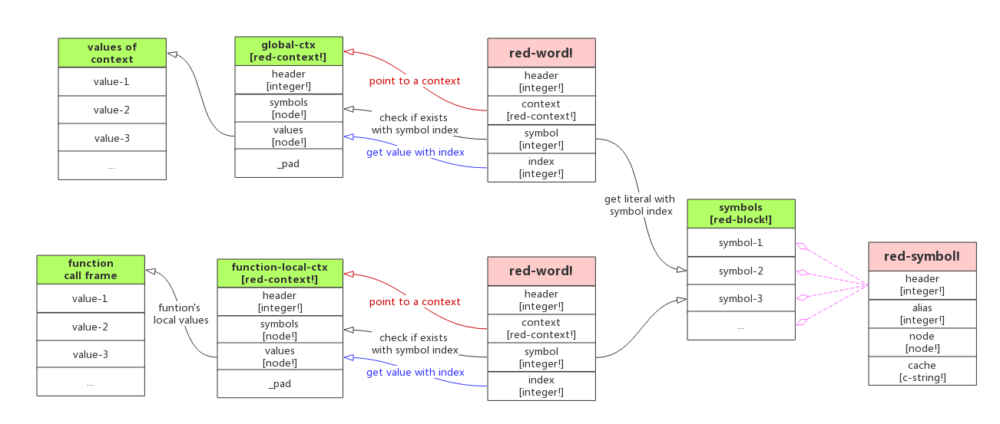

# 关于 Red 的一些要点

## 目录
- [`cell` & `node` & `buffer` 的关系](#cell-node-buffer-%E7%9A%84%E5%85%B3%E7%B3%BB)
- [`word` & `symbol` & `context` 的关系](#word-symbol-context-%E7%9A%84%E5%85%B3%E7%B3%BB)
- [Red `function!` 的实现](#red-function)


------

前面一篇文章 “[Red runtime 初始化](https://github.com/haolloyin/red/blob/v040/dig/red-runtime.md)” 以 Red 0.4.0 版本为出发点大概了解了 Red runtime 的构造和初始化过程，尤其是 Red 的内存结构和分配的规则。

不过那篇文章代码太多，结论太少，如果没有兴趣的话看起来很累又没有收获。建议不用看代码，直接看那 3 张内存结构的变化图就能了解。


## `cell` & `node` & `buffer` 的关系

Red runtime 的源码里经常会遇到这 3 个东西：`cell`、`node`、`buffer`，明确了它们的关系后很利于看代码：

```sql
1 node <==> 1 buffer ==> 管理 N cell
```

`cell!` 结构体含有 4 个成员，跟 [datatypes/structures.reds](https://github.com/red/red/tree/v0.4.0/red/runtime/datatypes/structures.reds) 里的绝大部分 `red-XXX!` 结构体都是兼容的，只要强制转换一下类型即可。

正是因为这一点，所有 `red-XXX!` 结构体的内存分配都是从 `root` 的 2000 个 cell 中分配到一个 cell，用来承载 `red-XXX!` 结构体，这个 `red-XXX!` 会指向一个 node，node 再指向 `series-buffer!`，而 `series-buffer!` 结构体本身用 `offset` 和 `tail` 指针来管理自己所申请的 cell。


##  `word` & `symbol` & `context` 的关系

简单读了一下 [REBOL 官方](http://www.rebol.com/books.html) 推荐的《REBOL - A Programmer's Guide》一书，在前几页就说出了 REBOL 程序的特点，恰巧我最近读了 Red runttime 源码之后，对 Red 也是这么理解的。抱歉我摘录在下面：

> **Programmer, word builder**
>
> In Rebol, everything boils down to words. Instructions, variables, functions and objects are all words. Some simply provide particular functionality. All these words belong to either a general context (the global context) or a specific context. Just as in a spoken language, a word may have a special meaning depending on the context in which it is evaluated.

也就是说，我们用 Red 和 REBOL （后面只写 Red，毕竟继承自 REBOL）写出来的代码都是 words，**不管是变量、函数、对象、操作符等等都是 word**，代码就是很多个单词组合在一起而已，跟写文章一样，所以书中这一节的标题是 `Programmer, word builder`。

> 注：数值不是 word，因为数值就是 10 个阿拉伯数字加几个标点符号，很容易用正则表达式辨别出来。

而文章中的单词有一个特点：**两两之间必须以空格隔开**。这个也是 Red 的特点，word 与 word 之间都是用空格隔开的，例如 `a + 2` 是表达式，而 `a+2` 是一个 word，因为 + 号两侧没有用空格隔开，整个被当成一个整体了。既然如此，Red 的词法分析器是很容易写的，用 split 函数切分一下就得到一个个 token 了。


另一个有趣的特点是英文中单词，它的动词、名词有一些变化规则来表示不同的意思，Red 与此很类似，它的 word 也有一套[规则](http://www.rebol.com/docs/core23/rebolcore-16.html#section-3.10)：

| Action | Type Word | Type Test | Conversion  |
| :----: | :-------: | :-------: | :---------: |
| word:  | set-word! | set-word? | to-set-word |
| :word  | get-word! | get-word? | to-get-word |
|  word  |   word!   |   word?   |   to-word   |
| 'word  | lit-word! | lit-word? | to-lit-word |

>注：上面表格中的 **lit** 是 **literal** 的缩写，是字面量的意思。

从上面的表格很容易看出来规则：一个 word 后面紧跟着冒号则表示赋值，前面加上冒号表示取值，前面加上单引号是取这个 word 自身的字面量。Red 的编译器、解释器也是这么处理的，例如遇到 ```a: 123``` 就知道是把整数 123 赋值给 a 这个 word，也就是变量，而不是把 `a:` 当作一个 word。


如上面引文所说的另一个特点：**每一个 word 在不同的 context 下有不同的意思**。这个跟书面语、口语这种自然语言几乎一致，我们理解一个词的意思是要根据上下文而定的，Red 虽然是一种编程语言，但它也是这么设计和构造的。

还有另一个概念是与此相关的：**symbol**，跟 word 不同，symbol 是没有任何概念上的意义的，只是表示一个唯一的不重复的记号，它的作用是用来区分。或者说，symbol 只表示它自己本身这个记号。例如 `abc` 和 `+` 是两个 word，我们肉眼一看知道是两个不同的记号即 symbol，不管它们在一个还是多个 context 中，始终是两个不同的 symbol。

上面关于 word 和 symbol 有点抽象，在 Red runtime 里面更容易理解：**一个 word 是跟 context 绑定的且带有特殊意义的 symbol**。

Red runtime 引入 symbol 这个概念的目的是：**一个相同的 word 分布在代码各处，总不能在内存里保存这个 word 的的多份拷贝导致浪费内存，因此引入一个全局的 symbols 表保存所有 word 的字面量。**

一个 word 持有 3 个字段：

1. 在 symbols 表中的下标，用于获取自己的字面量
2. 指向一个 context
3. 在 context 中的下标，这样才能查到 word 在当前所属上下文中的含义

画成图比较容易理解这三者之间的关系（代码见 [datatypes/structures.reds](https://github.com/red/red/tree/v0.4.0/red/runtime/datatypes/structures.reds#L110-L136) 和 [datatypes/context.reds](https://github.com/haolloyin/red/blob/v040/red/runtime/datatypes/context.reds#L54-L75)） ：




> **Red runtime 只有 1000 个 symbol，够用吗？**
>
> 如果你看了前面的文章，会知道 Red runtime 只有一个 symbols 全局变量记录了所有代码（runtime + 用户代码）的 symbol，但是它只有 1000 的 cell（见 [symbols](https://github.com/haolloyin/red/blob/v040/dig/red-runtime.md#symbols) 一节）。
>
> 也就是说，如果你的代码写了超过 1000 个不同的变量名（对应 1000 个 word），那 Red runtime 应该是会崩溃的吧（我没试过，要不你来试试写 `a1 ~~ a1000` 一共 1000 个变量来试试？）。
>
> 我在想，如果软件复杂度、代码规模够大的话，超过 1000 个 symbol 是有可能的吧？


## Red `function!` 的实现

我们故意写一个参数名、本地变量名跟外部变量一样的 [Red 函数](https://github.com/haolloyin/red/tree/v040/dig/test/test_func.red)，编译后观察得到的 stack-vm 指令结构来了解 Red function 的实现原理：

> 注意：Red function 是在 [v0.3.1 版本](https://www.red-lang.org/2012/12/red-v031-functions-support-added.html) 引入的，但我们是用开始自带二进制编译器的 v0.4.0 版本来编译并观察学习的。

```sql
Red [ ]

i: 1
j: 2
s: "hello"
b: ["aa" "bb" 222]

f: function [
    n [integer!]
    s [string!]          ;--参数
    return: [integer!]
    /local
        i [integer!]     ;--函数的本地变量
] [
    i: 2
    print s
    s: append s " world" ;--给全局变量重新赋值
    n: n + 3
    m: j + n + i         ;--同时使用全局变量、参数
    m
]

;print m     ;-- m 是 f 函数的本地变量，这里会报错
m: f 3 s
print s
type? :f
f2: :f
;print f2    ;-- REPL 和编译 exe print function! 都会导致 crash
;m: (f2 4 s) ;-- 看编译后的 stack-vm 是错的，不管是否加圆括号
```

得到的 stack-vm 指令截取函数定义部分如下（完整的可看[这里](https://github.com/haolloyin/red/tree/v040/dig/test/test_func_v3.reds)）：

> 如果用 `function` 来定义 Red 函数，编译器会自动收集本地变量，不需要写在 `/local` 后面，详见官网文章的说明：https://www.red-lang.org/2012/12/red-v031-functions-support-added.html，而用 `func` 则必须在 `/local` 后面手工写上该函数使用到的所有本地变量。

```sql
f_f: func [/local ~n ~s ~local ~i ~m] [
    push ctx202/values       ;--保存这个 context/values 原本的指针（虽然它原本就是 null）
    ctx202/values: as node! stack/arguments  ;--重新指向栈顶，即 value 是存在调用栈的，
    ;-- 上一行的代码在参考 context.reds 的实现：
    ;-- https://github.com/haolloyin/red/blob/v040/red/runtime/datatypes/context.reds#L204-L209
    
    ~n: stack/arguments      ;--第一个参数是参数栈的栈顶
    ~s: ~n + 1               ;--后面的参数逐步在前一个参数的基础上加一偏移
    ~local: ~s + 1           ;--原始函数中的 /local 修饰符也被当作一个参数
    ~i: ~local + 1           ;--本地参数 i
    ~m: ~i + 1               ;--本地参数 m，这是 Red 编译器自动收集到的，虽然我们没在 /local 后面声明
    _function/init-locals 3  ;--偏移并初始化参数栈顶指针 top，用 until 偏移了 4 次
    stack/mark-native ~f
    stack/reset
    stack/mark-native ~set
    integer/push 2           ;--把 2 弹出 stack/arguments
    word/set-local ~i        ;--从 stack/arguments 取值赋值给 i 变量
    stack/unwind
    stack/reset
    ------------| "i: 2"
    stack/mark-native ~print
    stack/push ~s
    natives/print*
    stack/unwind
    stack/reset
    ------------| "print s"
    stack/mark-native ~set
    stack/mark-native ~append
    stack/push ~s
    string/push str216
    actions/append* -1 -1 -1
    stack/unwind
    word/set-local ~s
    stack/unwind
    stack/reset
    ------------| {s: append s " world"}
    stack/mark-native ~set
    stack/mark-native ~add
    stack/push ~n
    integer/push 3
    actions/add*
    stack/unwind
    word/set-local ~n
    stack/unwind
    stack/reset
    ------------| "n: n + 3"
    stack/mark-native ~set
    stack/mark-native ~add
    stack/mark-native ~add
    word/get ~j
    stack/push ~n
    actions/add*
    stack/unwind
    stack/push ~i
    actions/add*
    stack/unwind
    word/set-local ~m
    stack/unwind
    stack/reset
    ------------| "m: j + n + i"
    stack/push ~m
    ------------| "m"
    stack/unwind-last
    ctx202/values: as node! pop
]
```

> **Red 暂时（<= v0.6.3）不支持闭包**
>
> 从上面前几行关于参数的初始化可以知道参数都是在调用栈中一次性初始化的，离开函数调用帧之前，所有参数的地址会被恢复，即最后一行 `ctx202/values: as node! pop`。
>
> [官网是这么说的](https://www.red-lang.org/2012/12/red-v031-functions-support-added.html)：Currently functions are using a local context on stack, so their life-time is very short. For indefinite extent support, a closure! type will be added in the next months.
>
> 不过至今 Red 还没有实现对应的 `closure!` datatype。

调用的代码是：

```sql
stack/mark-native ~set 
word/push ~m 
stack/mark-func ~f 
integer/push 3         ;-- 整数 3 入栈
word/get ~s            ;-- 取的变量 s 的值并入栈
f_f                    ;-- 调用并执行函数 f，只需要两个外部参数
stack/unwind 
word/set               ;-- 把函数 f 执行后的接过设置给 m
stack/unwind 
stack/reset 
------------| "m: f 3 s" 
```

上面是编译器对 function 调用的实现，如果你还有兴趣知道 `function!` 的内部实现，需要知道 `red-context!`（上一篇文章已经讲过，区别是函数的 context 不需要为 values 成员分配空间） 和 `red-block!` 的初始化，我摘录以下几段 stack-vm 的代码：

1. 准备初始化 `function!` 内部结构

```sql
stack/mark-native ~set
word/push ~f
_function/push blk201 blk203 ctx202 as integer! :f_f ;--4个参数：spec、body、ctx、code（函数指针）
word/set
stack/unwind
stack/reset
------------| {f: function [n [integer!] s [string!] return: [int...}
```

2. 先构造好 spec、body 和 context：

```sql
;--往前看 blk201 这个 spec 是怎么初始化的；yes 表示在栈中分配 values 的空间
;--传入 blk201 是需要知道 spec 有多少个成员，要以此来决定 context/symbols 的个数
ctx202: _context/make blk201 yes
stack/mark-native ~append
blk203: block/push* 19
set-word/push-local ctx202 3
block/append*
stack/keep
integer/push 2
block/append*
stack/keep
word/push ~print
block/append*
stack/keep
word/push-local ctx202 1

```

3. `function!` 内部结构体的初始化：[datatypes/function.reds](https://github.com/red/red/tree/v0.4.0/red/runtime/datatypes/function.reds#L227-L259)

```sql
push: func [
    spec	 [red-block!]
    body	 [red-block!]
    ctx		 [red-context!]               ;-- if not null, context is predefined by compiler
    code	 [integer!]
    return:	 [red-context!]               ;-- return function's local context
    /local
        fun    [red-function!]
        native [red-native!]
        value  [red-value!]
        more   [series!]
][
    #if debug? = yes [if verbose > 0 [print-line "_function/push"]]

    fun: as red-function! stack/push*
    fun/header:  TYPE_FUNCTION            ;-- implicit reset of all header flags
    fun/spec:	 spec/node
    fun/ctx:	 either null? ctx [_context/make spec yes][ctx]
    fun/more:	 alloc-cells 3            ;-- more 有 3 个成员：body / symbols / native

    more: as series! fun/more/value
    value: either null? body [none-value][as red-value! body]
    copy-cell value alloc-tail more       ;-- store body block or none
    alloc-tail more                       ;-- reserved place for "symbols"

    native: as red-native! alloc-tail more
    native/header: TYPE_NATIVE
    native/code: code                     ;-- 函数地址

    if all [null? ctx not null? body][
        _context/bind body fun/ctx        ;-- do not bind if predefined context (already done)
    ]
    fun/ctx                               ;-- 返回当前函数的 context
]
```

